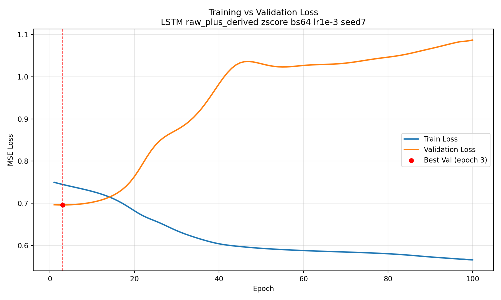

# robot-anomaly-detector v0.1

## Project Reflection

This project was my attempt to create an anomaly detection and attribution layer for deployed robots. Coming from an academic background, one of my biggest frustrations has always been the gap between working technology and deployable technology. Telemetry and debugging is a critical bottleneck for real robotic deployments and this was my attempt at contributing to the problem.

The current state of this project (`v0.1`) is best understood as a thin-data IMU anomaly-detection demo rather than a robust detector. The training corpus is small, the nominal coverage is narrow, and the provenance of the original robot/platform is not strong enough to support confident claims about generalization across runs or environments.

What `v0.1` does demonstrate well is the full pipeline:

- preprocessing and feature generation
- fold-based training and replay scoring
- synthetic anomaly injection
- replay visualization and debugging

What it does **not** demonstrate is a reliable notion of "normal" robot behavior across domain shift. The current architecture uses a reconstruction-MSE scoring system and is especially weak on low-frequency anomalies such as drift/freeze, which became much clearer during follow-up replay analysis.

## Data processing and training pipeline + architectural overview

The project pipeline has four major layers:

1. **Data processing**
   - restore clean overlap artifacts
   - build feature tables from IMU and derived features
   - fit fold-specific normalizers
   - generate train/validation window indices

2. **Modeling**
   - train LSTM and TCN autoencoder baselines on leave-one-run-out folds
   - score validation replay with reconstruction residuals
   - inject synthetic anomalies into replay windows for controlled evaluation
   - compute leaderboard metrics across folds and seeds

3. **Execution**
   - local Python path for development
   - CPU Docker path for local reproducibility
   - GPU Docker + ECR + EC2 launch path for larger search/training runs

4. **Demo / replay**
   - restore the selected final model
   - replay the held-out run `final_challenge_ugv2`
   - visualize anomaly score, threshold, grouped attribution, and injected anomalies

Architecturally, the final selected model is:

- `LSTM autoencoder`
- feature set: `raw_plus_derived`
- normalization: `zscore`
- batch size: `64`
- learning rate: `1e-3`

The model itself outputs a reconstruction of the normalized input window. The detector then computes squared residuals and collapses them into:

- a scalar anomaly score
- grouped residual scores for:
  - `quaternion`
  - `gyro`
  - `accel`

This was enough to support end-to-end training, evaluation, attribution, and replay. It was not enough to robustly capture all subtle anomaly types, which became clear during the held-out replay analysis.

Attribution in this version is group-level over `quaternion`, `gyro`, and `accel`, not per-channel root-cause attribution.

## Current evaluation status

The most defensible evaluation summary for `v0.1` comes from follow-up analysis on the saved final model and held-out replay. That analysis exposed two major issues:

- the originally exported final-training artifact was the **last-epoch checkpoint**, not the best-validation checkpoint
- the detector's alerting behavior on held-out replay is not reliable enough to support the earlier leaderboard-style summary

Reproduced training behavior for the selected `lstm / raw_plus_derived / zscore / bs64 / lr1e-3` configuration:

- best validation loss occurred at **epoch 3**
- validation MSE at epoch 3: **0.6961**
- final epoch-100 training MSE: **0.5658**
- final epoch-100 validation MSE: **1.0871**

This is a strong overfitting signature: the model continues improving on training windows while generalization degrades almost immediately.

Held-out replay findings:

- with the original global-threshold path, strict held-out injected-anomaly smoke tests on the reproduced epoch-3-equivalent checkpoint produced **0.0 strict detection rate** across the originally evaluated anomaly families
- several burst-like anomalies still produced clear score lift, which shows that the original thresholding logic was suppressing some real signal rather than the model being completely unresponsive
- a follow-up adaptive local-baseline trigger recovered a number of obvious burst/pulse/clipping-style anomalies, but it also produced a very large false-positive burden on the held-out replay:
  - clean held-out replay windows scored: **34,216**
  - clean held-out replay alert-active windows under the adaptive trigger: **11,811**
  - clean held-out replay alert onsets under the adaptive trigger: **51**
- subtle low-frequency faults such as drift/freeze remain poorly captured even after thresholding changes; for those faults, the score often barely moves at all

The practical conclusion is:

- the training and replay pipeline works
- the current score/threshold formulation is not robust
- the current dataset is too thin and too weakly specified to support strong claims about general anomaly detection
- `v0.1` should be treated as a debugging and pipeline prototype, not a reliable deployed detector

## Next steps for `v0.2`

For the next iteration of this project, I'd like to tackle a much more ambitious scope, modeling full cross-channel dependencies and adjusting the architecture to capture a broader range of anomalies.

The first major change I'd like to make is the data collection pipeline. `v0.1` was trained on data adapted from the SubT-MRS dataset. For `v0.2` I'd like to augment this data collection process by generating synthetic data in IsaacSim to create a larger dataset where we can also have more insight into the ground truth of the runs and inject anomalies in a more grounded way.

Secondly, I’d like to change not only the model architecture, but also the scoring and detection formulation. The main lesson from `v0.1` is that a pooled reconstruction-residual score is too blunt for subtle faults like drift and freeze. For `v0.2`, I would explore:

- **forecasting-based detectors**
  - short-horizon prediction error instead of pure reconstruction error
  - better suited to faults that break temporal evolution rather than instantaneous shape
- **group-aware / state-aware scoring**
  - separate scoring for gyro, accel, and orientation-related features
  - thresholds conditioned on operating regime rather than one global cutoff
- **change-detection style methods**
  - cumulative or smoothed detectors that capture small persistent shifts
- **stronger sequence models**
  - transformer-style architectures or richer latent-variable models that can model cross-channel structure more explicitly than the current LSTM autoencoder

In short, `v0.2` should aim to solve three problems that `v0.1` surfaced clearly:

1. more realistic and scalable data
2. stronger sequence modeling of physical sensor dependencies
3. a better anomaly score than pooled reconstruction residuals

## Final Thoughts

I would love to continue working on this problem in the future and will continue to publish updates to this repo as well as potential future blog posts with more in-depth deep dives into the development process, likely on my [substack](https://substack.com/@benzhnng?). Feel free to reach out to bezh@seas.upenn.edu with any questions or comments.
